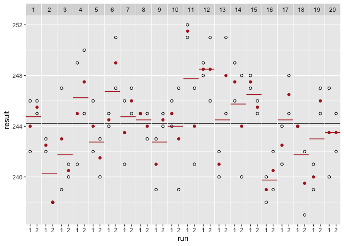

<!-- README.md is generated from README.Rmd. Please edit that file -->

# RIVD

<!-- badges: start -->

<!-- badges: end -->

The goal of RIVD is to deliver simple tools and adapted outputs for in
vitro diagnostic (IVD) assay performances assessment. The results can be
used in early assay development phase or hopefully with compliance with
regulatory frameworks. The package is built according to the
recommandation formulated in the CLSI
guidelines.

## Installation

<!-- You can install the released version of RIVD from [CRAN](https://CRAN.R-project.org) with: -->

<!-- ``` r -->

<!-- install.packages("RIVD") -->

<!-- ``` -->

You can install the development version from
[GitHub](https://github.com/) with:

``` r
# install.packages("devtools")
devtools::install_github("Felixmil/RIVD")
```

## Example

Performance report for assay’s precision.

``` r
library(RIVD)
library(knitr)
library(magrittr)
data(Glucose,package="VCA")

perfPrecision(Glucose, 'result','run', 'day') %>% kable()
```

|         |       DF |    %Total |       SD |   CV\[%\] |
| ------- | -------: | --------: | -------: | --------: |
| total   | 64.77732 | 100.00000 | 3.596325 | 1.4726965 |
| day     | 19.00000 |  15.14319 | 1.399483 | 0.5730889 |
| day:run | 20.00000 |  23.77537 | 1.753568 | 0.7180867 |
| error   | 40.00000 |  61.08144 | 2.810694 | 1.1509803 |

Plot of data points

``` r
library(RIVD)
data(Glucose,package="VCA")
plotPrecision(Glucose, 'result','run', 'day')
```


